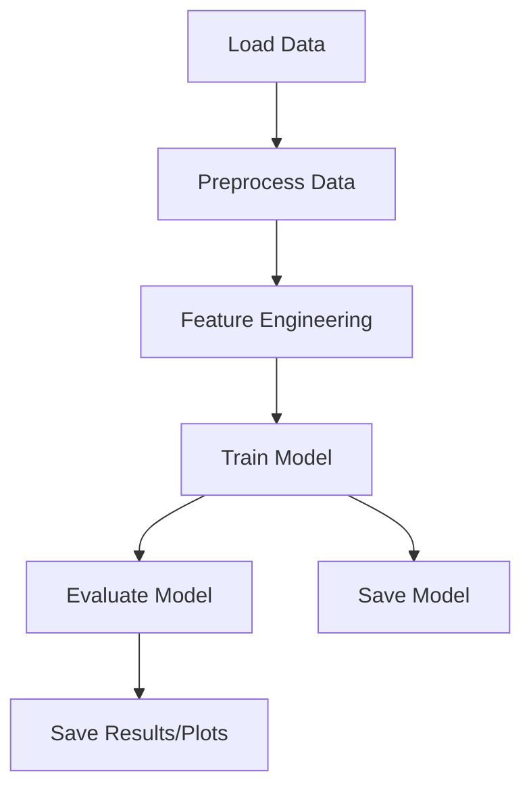

# python-machine-learning-UNISC

## Features

This repository offers a solid foundation for machine learning projects using Python. It includes a variety of resources, scripts, and notebooks that cover different aspects of machine learning, from data preprocessing to model evaluation. The project is structured to support experimentation, reproducibility, and easy extension for academic or research purposes.

- Diverse machine learning examples covering supervised and unsupervised learning.
- Jupyter notebooks for interactive experimentation.
- Scripts for data preprocessing, feature engineering, training, and evaluation.
- Clear directory organization for datasets, models, and results.
- Support for common ML libraries (scikit-learn, pandas, numpy, matplotlib).

---

## Introduction

This project was developed as part of coursework at UNISC (Universidade de Santa Cruz do Sul) and serves as a comprehensive resource for students and practitioners of machine learning. It demonstrates practical implementations of core ML concepts, providing examples, exercises, and structured code to facilitate learning and experimentation with Python-based machine learning workflows.

Whether you are a beginner looking to learn, or an experienced user seeking a test-bed for algorithms, this repository aims to be a valuable resource.

---

## Requirements

Before using the project, ensure your environment meets these requirements:

- Python 3.7 or higher
- Jupyter Notebook (for interactive exploration)
- pip (Python package installer)

The core dependencies include:

- numpy
- pandas
- scikit-learn
- matplotlib
- seaborn (optional, for advanced visualizations)
- joblib (for model serialization)

To install all dependencies at once, use the provided `requirements.txt` file.

---

## Installation

Follow these steps to get started with the project on your local machine:

1. **Clone the Repository:**

   ```bash
   git clone https://github.com/AlecKnipphoffDaCruz/python-machine-learning-UNISC.git
   cd python-machine-learning-UNISC
   ```

2. **Create and Activate a Virtual Environment (Recommended):**

   ```bash
   python -m venv venv
   source venv/bin/activate  # On Windows: venv\Scripts\activate
   ```

3. **Install Dependencies:**

   ```bash
   pip install -r requirements.txt
   ```

4. **Start Jupyter Notebook:**

   ```bash
   jupyter notebook
   ```

Now, you can navigate to the notebooks and scripts provided in the repository.

---

## Usage

You can use this repository in several ways to suit different workflows:

- **Interactive Notebooks:** Browse the `notebooks` directory for hands-on examples and exercises. Each notebook is self-contained, with explanations, code, and outputs.
- **Scripts:** Use the `scripts` directory for standalone Python files that implement data preparation, model training, and evaluation.
- **Datasets:** Place your datasets in the `data` directory. Many scripts and notebooks expect data to be available here.
- **Models:** Trained models are saved in the `models` directory for easy reuse and deployment.
- **Results:** Output files, plots, and evaluation metrics are saved in the `results` directory for later analysis.

### Example Workflow

1. **Prepare data:** Use the provided data preprocessing scripts or follow instructions in the notebooks.
2. **Train models:** Run training scripts or cells within a notebook to train machine learning models.
3. **Evaluate models:** Visualize results and metrics to assess model performance.
4. **Experiment:** Modify configurations, try new algorithms, or implement your own solutions based on the provided structure.

### Example: Running a Notebook

```bash
jupyter notebook notebooks/classification_example.ipynb
```

---

## Configuration

Most configuration options are provided within each script or notebook as code cells or Python variables. Typical configurable parameters include:

- Dataset paths
- Model hyperparameters (e.g., number of trees for random forests)
- Training/testing split ratios
- Output directories

For more advanced customization, you can edit the configuration sections at the top of each notebook or script.

### Example Configuration in a Script

```python
# Set dataset path
DATA_PATH = 'data/my_dataset.csv'

# Model parameters
N_ESTIMATORS = 100
TEST_SIZE = 0.2
RANDOM_STATE = 42
```

Remember to adjust these parameters to fit your data and experiment needs.

---

## Project Structure Diagram

Below is a high-level overview of the typical workflow in this repository:



---

For questions, contributions, or issues, please refer to the project's GitHub page or contact the repository maintainer. Happy experimenting with machine learning!